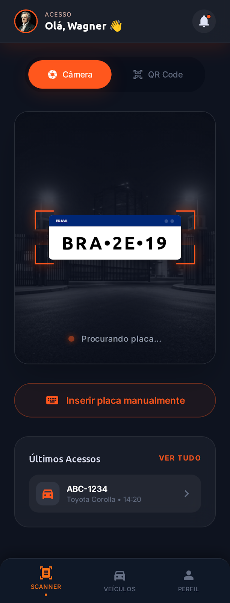
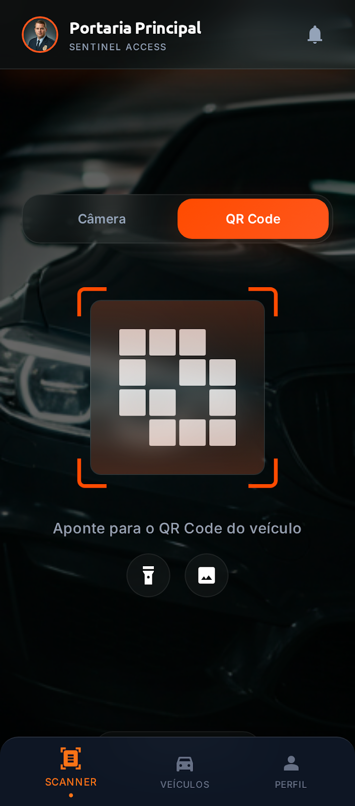
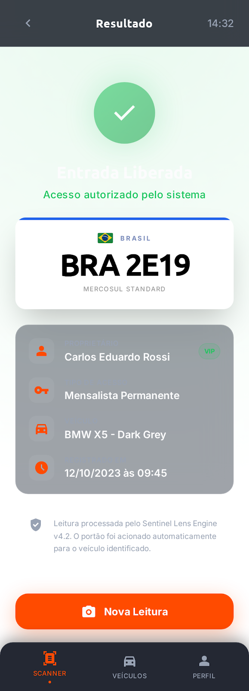
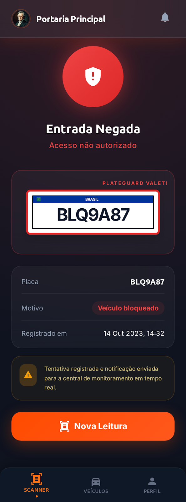
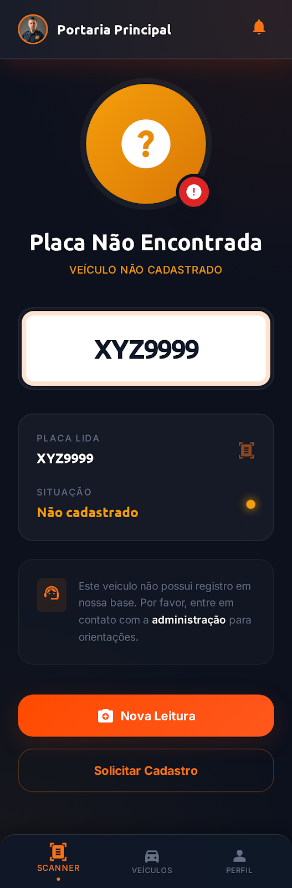
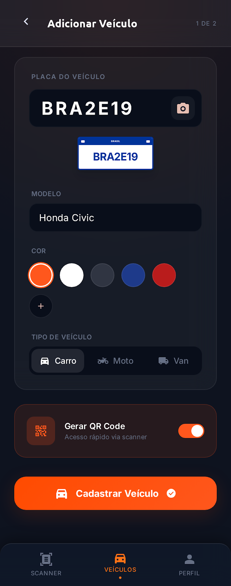
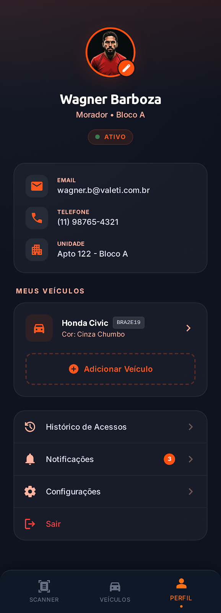

<p align="center">
  <h1 align="center">PlateGuard</h1>
  <p align="center">
    Sistema de controle de acesso veicular com OCR on-device, QR Code e feedback visual em tempo real.
  </p>
</p>

<p align="center">
  
  
  
  
  
  
</p>

---

## Screenshots

<p align="center">
  
  
  
  
</p>
<p align="center">
  
  
  
</p>

---

## Sobre o Projeto

PlateGuard e uma POC (Proof of Concept) com arquitetura profissional e escalavel para controle de acesso veicular em condominios e estacionamentos.

O app aponta a camera para uma placa veicular, realiza OCR on-device via ML Kit, envia a placa para um backend NestJS e exibe feedback visual instantaneo: entrada liberada, negada ou placa nao encontrada. Tambem suporta leitura de QR Code como metodo alternativo de entrada.

**Objetivo:** Demonstrar maturidade tecnica em um projeto fullstack mobile com arquitetura limpa, design system consistente e boas praticas de engenharia.

---

## Funcionalidades

- **Scanner de placa via camera** - OCR on-device com ML Kit (sem trafego de imagem)
- **Leitura de QR Code** - Modo alternativo com toggle na tela de scan
- **Consulta veicular simulada** - API fake estilo DETRAN com auto-preenchimento de dados
- **Cadastro de veiculo** - Formulario com preview de placa em tempo real e dados auto-preenchidos
- **Feedback visual por tipo** - 5 estados: Liberado, Negado, Nao Encontrado, Placa Invalida, Erro de Servidor
- **Perfil com foto persistida** - Image picker + persistencia via MMKV
- **Splash screen com video** - Animacao de abertura com react-native-video
- **Design system dark** - Glassmorphism, tokens centralizados, zero valores hardcoded
- **Custom alerts** - Alertas estilizados sem uso do Alert nativo
- **Swipe-to-delete** - Gestos nativos para remocao de veiculos
- **Error handling centralizado** - Handlers dedicados por tipo de erro (src/handlers/)
- **133 testes automatizados** - 88 mobile + 45 backend

---

## Arquitetura

```
scan-plate/
├── app-backend/     NestJS + Prisma + SQLite
├── app-mobile/      React Native CLI + TypeScript strict
├── docs/            Decisoes tecnicas, contrato de API, roadmap
└── scripts/         Setup automatizado
```

**Backend:** Controller recebe, delega ao Service, que consulta o Repository. Toda tentativa de acesso e registrada em AccessLog com metodo de entrada (CAMERA, QR_CODE, MANUAL).

**Mobile:** Cada rota segue o padrao `index.tsx` (UI) + `hook` (logica) + `styles.ts` (estilos). Nenhuma logica de negocio em componentes de UI. Chamadas de API sempre via camada de servico + React Query.

**Error handling:** Interceptacao centralizada de erros com handlers dedicados. O mobile nunca interpreta status HTTP diretamente - sempre le o `feedbackType` do payload.

---

## Tech Stack

### Backend

| Tecnologia | Versao | Funcao |
|---|---|---|
| Node.js | 20.x | Runtime |
| NestJS | 11.x | Framework com DI nativa |
| TypeScript | 5.x | Strict mode |
| Prisma | 6.x | ORM com migrations |
| SQLite | - | Banco embedded |
| Swagger | 11.x | Documentacao automatica |
| Throttler | 6.x | Rate limiting |
| Jest | 30.x | Testes |

### Mobile

| Tecnologia | Versao | Funcao |
|---|---|---|
| React Native CLI | 0.84 | Sem Expo - controle total |
| TypeScript | 5.x | Strict mode |
| React Navigation | 7.x | Stack + Bottom Tabs |
| Zustand | 5.x | Estado global |
| TanStack Query | 5.x | Cache e requisicoes |
| Reanimated | 4.x | Animacoes na UI thread |
| Vision Camera | 4.x | Camera nativa |
| ML Kit OCR | 0.3 | OCR on-device |
| MMKV | 4.x | Persistencia local |
| react-native-video | 6.x | Splash animada |
| Jest | 29.x | Testes |

---

## Como Rodar

### Pre-requisitos

- Node.js >= 20
- Yarn
- Xcode (iOS) ou Android Studio (Android)
- CocoaPods (iOS)

### Setup

```bash
# Clonar o repositorio
git clone https://github.com/wagnerbarboza/scan-plate.git
cd scan-plate

# Backend
cd app-backend
yarn setup          # instala deps + roda migrations + seed
yarn start          # inicia em modo watch na porta 3000

# Mobile (em outro terminal)
cd app-mobile
yarn setup          # instala deps + pod install
yarn start          # inicia o Metro bundler
yarn ios            # ou yarn android
```

### Endpoints uteis

| Endpoint | Descricao |
|---|---|
| `GET /health` | Health check |
| `GET /api/docs` | Swagger UI |
| `POST /vehicle-access/validate` | Validar placa |
| `POST /vehicle-access/validate-qr` | Validar QR Code |
| `POST /vehicles` | Cadastrar veiculo |
| `GET /vehicles` | Listar veiculos |

---

## Estrutura de Pastas

```
app-backend/
├── prisma/              Schema, migrations, seed
├── src/
│   ├── modules/
│   │   ├── vehicle-access/    Validacao de placa e QR Code
│   │   ├── vehicles/          CRUD de veiculos
│   │   ├── vehicle-lookup/    Consulta veicular simulada
│   │   ├── access-log/        Registro de tentativas
│   │   └── health/            Health check
│   └── shared/                Config, filtros, logger
└── test/                      Testes unitarios e e2e

app-mobile/
├── src/
│   ├── routes/                Telas (index + hook + styles)
│   │   ├── ScanPlate/         Scanner de placa
│   │   ├── PlateCapture/      Captura com camera
│   │   ├── Feedback/          Resultado da validacao
│   │   ├── Profile/           Perfil do usuario
│   │   ├── VehicleRegistration/  Cadastro de veiculo
│   │   └── Vehicles/          Lista de veiculos
│   ├── components/            GlassCard, BrazilianPlate, AppHeader...
│   ├── handlers/              Error handling centralizado
│   ├── hooks/animations/      Reanimated hooks reutilizaveis
│   ├── service/               Camada de API (axios + React Query)
│   ├── store/                 Zustand stores
│   ├── theme/                 Tokens, glassmorphism, tema
│   ├── types/                 Tipos compartilhados
│   ├── locales/               i18n (pt-BR)
│   └── constants/             Regex de placa, config de API
└── __tests__/                 Testes
```

---

## Testes

O projeto possui **133 testes automatizados** distribuidos entre backend e mobile.

```bash
# Backend (45 testes)
cd app-backend && yarn test

# Mobile (88 testes)
cd app-mobile && yarn test
```

| Suite | Testes | Cobertura |
|---|---|---|
| vehicle-access.service | Validacao de placa, QR Code, 5 feedbackTypes | 45 backend |
| vehicle-lookup.service | Consulta veicular simulada | |
| vehicles.service | CRUD de veiculos | |
| vehicle-access.e2e | Integracao HTTP completa | |
| plate.test | Regex Mercosul + formato antigo | 88 mobile |
| extractPlate.test | Extracao OCR com correcao de caracteres | |
| vehicleAccessApi.test | Camada de servico | |
| vehicleLookupApi.test | Consulta veicular | |
| stores | Zustand state management | |

---

## Decisoes Tecnicas

Todas as decisoes de arquitetura estao documentadas com justificativa em [`docs/decisions.md`](docs/decisions.md):

- Por que **NestJS** e nao Express puro
- Por que **React Native CLI** e nao Expo
- Por que **Reanimated** e nao Animated nativo
- Por que **SQLite** e nao PostgreSQL
- Por que **glassmorphism** como padrao visual
- Quando adicionar **Redis**, **RabbitMQ** e **Circuit Breaker**
- Estrategia de **QR Code** como fallback do OCR

---

## Dados de Demonstracao (Seed)

| Placa | Proprietario | Status | Tipo | Modelo |
|---|---|---|---|---|
| BRA2O26 | Wagner Barboza | ALLOWED | resident | Honda Civic |
| ABC3D45 | Maria Silva | ALLOWED | resident | Toyota Corolla |
| XYZ1234 | Joao Santos | ALLOWED | visitor | Fiat Uno |
| BLQ9A87 | - | DENIED | blocked | - |
| PEN5B23 | - | PENDING | resident | - |

> Placas ALLOWED possuem `qrCodeToken` gerado automaticamente para teste do modo QR Code.

---

## Autor

**Wagner Barboza** - Desenvolvedor Fullstack

---

<p align="center">
  <sub>PlateGuard - POC com arquitetura profissional para controle de acesso veicular</sub>
</p>
